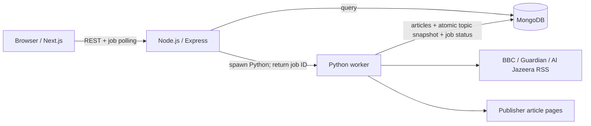
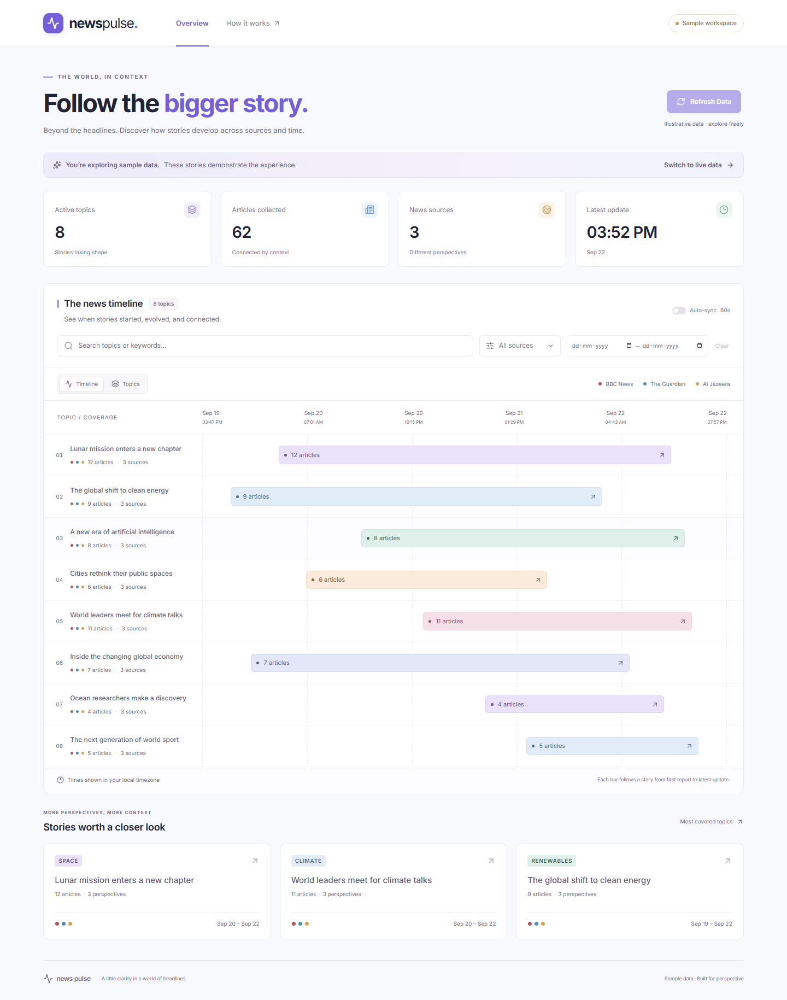

# News Pulse

**Follow the bigger story.** A full-stack news explorer that collects live RSS reporting, extracts article text, groups related stories, and maps their activity across time.

## What is implemented

- Three real publishers: BBC News, The Guardian, and Al Jazeera.
- Python normalization, full-text extraction, summary fallback, deduplication, and TF-IDF clustering.
- Separate Express REST API with MongoDB persistence, validated filters, asynchronous ingestion jobs, concurrency protection, and health checks.
- Next.js JavaScript dashboard with an interactive time-range chart, chronological story drawer, search/source/date filters, ingestion polling, and optional 60-second timeline sync.
- Explicitly labeled sample mode. Live data is the default; failures never silently turn into sample data.
- Keyboard-accessible native dialogs, responsive horizontal chart scrolling, reduced-motion support, loading/empty/error states, and self-hosted Inter fonts.
- Docker, Render, Vercel, CI, tests, screenshots, and a walkthrough script.

**Repository:** [kumaraman22/news-pulse](https://github.com/kumaraman22/news-pulse).

**Deployment status:** GitHub source handoff only for now. The intended project owner will connect her own Vercel, Render, and MongoDB Atlas accounts. No hosted live URL or recorded walkthrough has been submitted. See [delivery checklist](docs/DEPLOYMENT.md).

## Architecture



`frontend/` contains the Next.js App Router, components, and API client. `backend/` contains Express, Mongoose schemas, and subprocess management. `pipeline/` contains feed configuration, pure normalization/clustering functions, and the ingestion worker. There is no Express API inside Next.js and no TypeScript application code.

## Local setup

Requirements: Node.js 22+, Python 3.12+, and MongoDB (local or Atlas). Python 3.12 is the CI/runtime reference version. Docker is optional.

```sh
npm ci
python -m venv .venv
# macOS/Linux
.venv/bin/pip install -r pipeline/requirements.lock
# Windows PowerShell
.venv/Scripts/python.exe -m pip install -r pipeline/requirements.lock
```

Copy `backend/.env.example` to `backend/.env` and `frontend/.env.example` to `frontend/.env.local`. Set `PYTHON_BIN` to the absolute path of your virtual environment's Python executable. Both Python and Express load the same backend environment file. A `pipeline/.env` override is optional; avoid conflicting database settings.

Start a database in a separate terminal using one option:

```sh
# Convenient development-only MongoDB downloader/runner; keeps data in .local/mongo
npm run dev:database
# Or run MongoDB using Docker
docker compose up -d mongo
```

The development runner uses a real MongoDB process, not a mocked database. Its first run downloads a MongoDB binary. Do not expose this unauthenticated local database to a public network. For production use Atlas with authentication and a scoped network allowlist.

```sh
npm run dev
```

Open `http://localhost:3000`, then click **Refresh Data**. API: `http://localhost:4000/api`. If port 3000 is occupied, Next.js prints the alternate port; add that exact origin to `FRONTEND_ORIGIN` and restart the API. Use `/?demo=1` or the sample-mode button for the clearly labeled demonstration dataset. Sample mode does not trigger live ingestion.

To run the backend and MongoDB together in containers, use `docker compose up --build`; run the frontend with `npm run dev -w frontend`.

## Environment variables

| Variable | Location | Default / purpose |
| --- | --- | --- |
| `NEXT_PUBLIC_API_URL` | frontend | `http://localhost:4000/api`; set before Vercel build |
| `MONGODB_URI` | backend / pipeline | MongoDB URI; never expose in frontend |
| `MONGODB_DB` | backend / pipeline | `news_pulse`; both runtimes must agree |
| `FRONTEND_ORIGIN` | backend | Comma-separated exact origins; default localhost:3000 |
| `PORT` | backend | `4000`; hosting platform may override |
| `PYTHON_BIN` | backend | `python`; use the virtual environment path locally |
| `SIMILARITY_THRESHOLD` | backend / pipeline | `0.18`, cosine similarity cutoff |
| `MAX_ARTICLES_PER_FEED` | backend / pipeline | `25`; range 1–100 |
| `CLUSTER_WINDOW_DAYS` | backend / pipeline | `7`; range 1–30 |
| `HTTP_TIMEOUT_SECONDS` | pipeline | `15`; range 1–30 |
| `INGEST_TIMEOUT_MS` | backend | `600000`; maximum worker runtime |
| `INGEST_COOLDOWN_MS` | backend | `60000`; global cooldown after successful refresh |
| `TRUST_PROXY` | backend | `0` locally; `1` for the supplied Render configuration |

All `.env` files, local database files, build output, and dependency folders are gitignored. `.env.example` files contain no credentials. Public frontend variables are embedded into the browser bundle; they must never contain secrets.

## Ingestion and extraction

Feeds are configured in `pipeline/feeds.json`:

- BBC News: `https://feeds.bbci.co.uk/news/world/rss.xml`
- The Guardian: `https://www.theguardian.com/world/rss`
- Al Jazeera: `https://www.aljazeera.com/xml/rss/all.xml`

The worker normalizes `summary`, `description`, and `content:encoded`, strips HTML, resolves relative links, normalizes timestamps to UTC, and tolerates missing authors/images. Missing, invalid, or future dates use ingestion time and are flagged `dateEstimated` in the UI. It removes common tracking parameters and fragments while retaining meaningful query parameters.

Before extraction, it checks unique normalized URLs and a SHA-256 fingerprint of source + normalized headline. Existing entries are skipped. Redirected URLs are normalized again before insertion; MongoDB unique indexes prevent races. The headline fingerprint deliberately suppresses duplicate feed links from the same publisher, but can also suppress a later article reusing exactly the same headline. Existing articles are not re-extracted on every run.

Four extraction workers per feed retrieve article pages with bounded timeouts, redirects, and response sizes. Trafilatura extracts the body; BeautifulSoup's article/main paragraphs are the fallback. If both fail, the RSS summary remains and the article is labeled accordingly. Extracted content is capped at 100,000 characters. Individual article/feed failures do not abort other sources. If all feeds fail, the job fails and preserves the previous timeline.

Only configured feeds are accepted, not arbitrary URLs supplied by API callers. Downloads validate public addresses and redirect destinations. Feed warnings and extraction counts are available on the job endpoint without exposing stack traces or secrets.

## Topic grouping and its tradeoffs

The pipeline uses scikit-learn TF-IDF with lowercase text, English/news boilerplate stop words, alphabetic tokens, unigrams + bigrams, sublinear term frequency, and up to 12,000 features. Text is **headline twice + summary**, giving headlines extra weight while avoiding body boilerplate.

Articles are sorted chronologically (ID breaks ties). Each article joins the closest current cluster centroid when cosine similarity is at least **0.18**; otherwise it starts a new cluster. Centroids are recomputed after each addition. This avoids the connected-component approach's chain of pairwise similarities joining unrelated endpoints. Labels use the three highest-weight non-overlapping terms; a headline is the fallback for an empty vocabulary. A cluster ID is derived from the lexicographically smallest member URL.

**Why 0.18:** a local inspection compared 0.28, 0.22, and 0.18 on collected reporting. The higher cutoffs missed same-story pairs about Google's Irish privacy fine and Germany's election results. At 0.18, those pairs joined while the inspected unrelated stories stayed separate. This is a pragmatic starting point, not a measured universal optimum. It is configurable and tested with related/unrelated fixtures.

**Limitations:** lexical similarity can miss paraphrases, combine stories sharing prominent names, and yield awkward keyword labels. The deterministic greedy pass is sensitive to the set of input articles. IDs may change if a newly added URL sorts before a cluster's previous anchor or when the window expires. Single-article topics are expected. No paid AI service is used.

The active timeline includes at most the latest **1,000 articles from seven days**. The cap bounds CPU, memory, and API payloads for small hosting instances; the UI discloses truncation. Historical articles remain in MongoDB. Add a retention policy before operating indefinitely.

## Database and publication consistency

- `articles`: article metadata, extracted content, extraction status, publication/ingestion dates, and advisory `clusterId`. Unique URL and source/headline fingerprint indexes; source/date indexes support queries.
- `snapshots`: one document, `_id: "timeline"`, containing bounded embedded Cluster records with IDs, labels, keywords, article IDs, counts, sources, and timestamps.
- `ingestionjobs`: persistent statuses, progress, counts, per-feed results, warnings, and timestamps. A unique partial index allows only one `active: true` job across API instances.

Python writes all new articles first, then atomically replaces the complete snapshot in a single MongoDB operation. Express reads this snapshot and resolves its article IDs; readers cannot see a half-deleted or half-rebuilt cluster list. Article `clusterId` values are convenience metadata; the snapshot's membership is authoritative. This works on standalone local MongoDB without requiring transactions or a replica set.

The API starts Python without a shell and returns a job immediately. The worker writes a heartbeat every 10 seconds. A recovery check every 15 seconds fails jobs whose heartbeat is over 90 seconds old, including after API restarts, so abandoned jobs cannot hold the refresh lock indefinitely. A separate maximum-runtime timeout still applies. Article-level progress updates make long feed extractions visible. Browser polling reconnects after transient network failures and remembers the job ID in session storage. Auto-sync fetches the timeline every 60 seconds while the page is visible; it does not launch ingestion. Collection happens on Refresh Data.

The normal `npm run dev` command keeps the API process stable while the frontend hot-reloads. Restart the API after backend edits. `npm run dev:watch -w backend` enables optional backend file watching; editing files during collection may interrupt its worker.

## API

Both `/api`-prefixed URLs and the original assessment's root paths work.

| Method | Path | Response |
| --- | --- | --- |
| GET | `/api/clusters` | `{data: [cluster summaries], meta}` |
| GET | `/api/clusters/:id` | `{data: {...cluster, articles: [...]}}` sorted oldest first |
| GET | `/api/timeline` | Chart-ready `{data, meta}` with ID, label, times, count, sources, intensity |
| POST | `/api/ingest/trigger` | `202 {jobId, status: "queued"}`; empty JSON body |
| GET | `/api/ingest/status/:jobId` | Status, progress, counts, warnings, per-feed results |
| GET | `/api/health` | `200` when MongoDB is connected, otherwise `503` |

List, timeline, and detail endpoints accept `source`, `search`, `start`, and `end`. Dates must be ISO timestamps with timezone offsets; ranges are inclusive. UI dates use the browser's local day boundaries. Source/date filters recompute membership, counts, sources, and time extents; the detail drawer receives the same filters. Search matches topic labels and keywords as literal case-insensitive text, not arbitrary regular expressions. Invalid/unknown parameters return `400`.

Errors use `{error: {message}}`. Codes: `400` invalid input, `404` missing resource, `409` ingestion already running (includes `jobId`), `429` rate limit/cooldown, `500` unexpected server error, `503` database unavailable. IDs must be 24 lowercase hexadecimal characters. CORS restricts browser access to configured origins. The public refresh endpoint intentionally supports evaluation without login; it has a per-IP rate limit, global cooldown, and a database-enforced single-worker lock. Add authenticated administration/quotas for a broader public rollout.

## Tests and quality checks

```sh
python -m pytest pipeline/tests -q
npm test
npm run build
npx playwright install chromium
npm run test:e2e
```

Use the virtual environment's Python if it is not activated. Backend tests use isolated real MongoDB processes. Browser tests cover the timeline, keyboard dismissal, source filtering, no-results state, date validation, error recovery, accessibility checks, and layout at 1440, 768, 375, and 320 pixels. Screenshots are generated under `docs/screenshots/`.

For real-feed browser verification, start the full stack and set `TEST_LIVE=1` before `npm run test:e2e`. Optional `PLAYWRIGHT_BASE_URL` supports another local frontend port; `PLAYWRIGHT_EXECUTABLE_PATH` supports an already-installed Chromium binary. CI uses Playwright's bundled browser. Live-feed tests are opt-in to avoid making CI depend on third-party publishers.

## Screenshots



The `docs/screenshots/` folder also includes mobile/tablet layouts and, after an opt-in live test, actual live dashboard/story captures. Sample screenshots are illustrative and never presented as real reporting.

## Deployment and submission

See [deployment guide](docs/DEPLOYMENT.md), [phase checklist](docs/PHASES.md), and [2–3 minute walkthrough script](docs/VIDEO_WALKTHROUGH.md). Frontend runs on Vercel, Express and Python share one Render Docker service, and Atlas stores all persistent data. The Docker runtime packages both languages so on-demand subprocess ingestion works after deployment. Render documents this runtime at [Docker on Render](https://render.com/docs/docker); extraction uses [Trafilatura's documented API](https://trafilatura.readthedocs.io/en/latest/corefunctions.html).

The six assessment screenshots show pages 1–6 of an eight-page assessment. The separate nine-page build prompt was fully available. Original assessment pages 7–8 are still needed to verify any additional submission/evaluation instructions.

## Future improvements

- Evaluate clustering against a manually labeled story set and calibrate precision/recall.
- Incremental vectors, stronger entity matching, and stable topic lineage across refreshes.
- Publisher-aware retries, content-update detection, configurable retention, and durable queue workers for larger ingestion loads.
- Authenticated refresh administration, distributed rate limiting, metrics, and scheduled ingestion.
